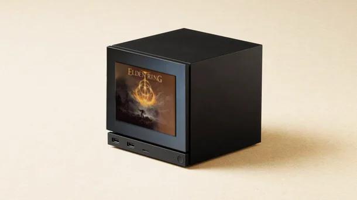

Maker Media GmbH

***

# Spieleanzeige für die Steam Machine

**Welches Spiel läuft gerade auf der Steam Machine? Ein ESP32 und ein vierfarbiges E-Ink-Display machen die Antwort direkt an der Front sichtbar.**

Der vollständige Artikel zum Projekt steht in der **[Make-Ausgabe 5/26 ab Seite 70](https://www.heise.de/select/make/2026/5)**.
